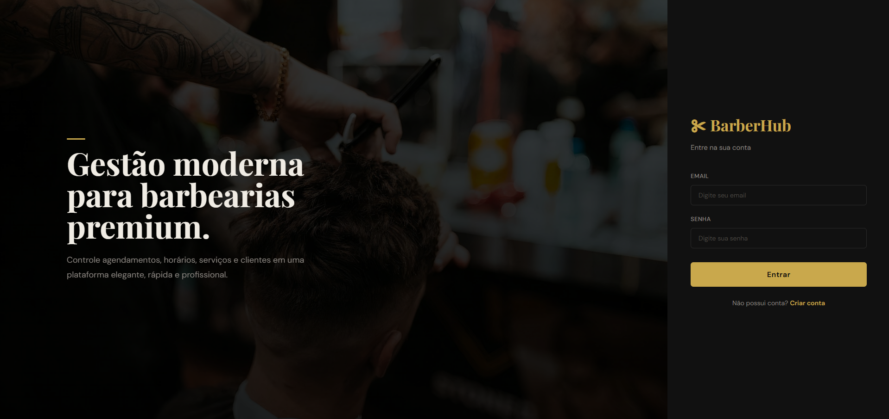
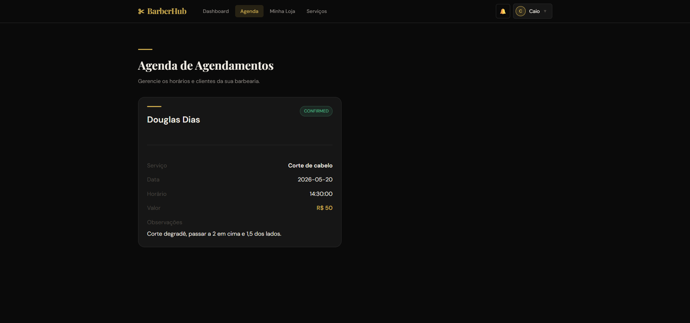
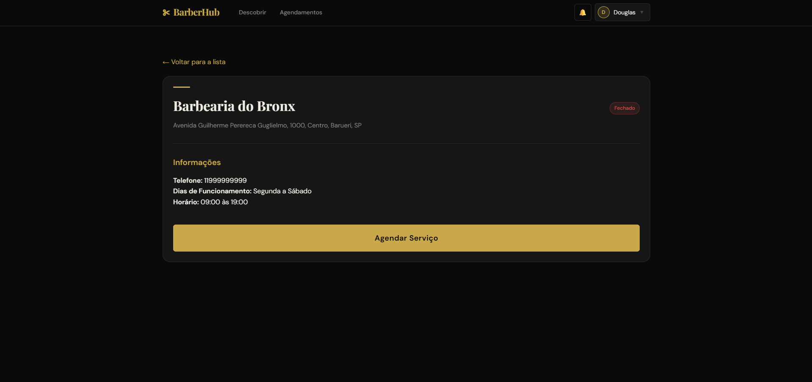

# 💈 BarberHub

O **BarberHub** é uma plataforma Full-Stack de agendamentos para barbearias. O sistema permite que clientes encontrem as barbearias mais próximas utilizando geolocalização em tempo real, acompanhem seus agendamentos e vejam os valores formatados, enquanto os proprietários de barbearias possuem um painel administrativo para gerenciar, aprovar ou rejeitar novos horários marcados.

---

## 📸 Demonstração da Aplicação

<div align="center">
  
  
  
</div>

---

## 🛠️ Tecnologias Utilizadas

### **Backend**
* **Java 17** & **Spring Boot 3**
* **Spring Data JPA** (Persistência de dados)
* **H2 Database** (Utilizado exclusivamente para isolamento em ambiente de testes)
* **Fórmula de Haversine** (Cálculo matemático de distância geográfica entre coordenadas)

### **Frontend**
* **React.js** & **Vite**
* **Axios** (Consumo de API HTTP)
* **React Router Dom** (Gerenciamento de rotas e parâmetros dinâmicos)

### **Infraestrutura e Banco de Dados**
* **PostgreSQL** (Banco de dados de produção)
* **Docker** & **Docker Compose** (Containerização da aplicação e do banco)

---

## 🔒 Arquitetura de Segurança Backend (Boas Práticas Implementadas)

O ecossistema de segurança do **BarberHub** foi desenvolvido utilizando o **Spring Security 6**, priorizando os padrões modernos de proteção para APIs RESTful:

### 1. Autenticação Stateless (JWT)
A API adota o modelo de autenticação baseada em tokens auto-contidos (**JWT**), injetando um `JwtAuthenticationFilter` antes do interpretador padrão de usuário e senha do Spring (`UsernamePasswordAuthenticationFilter`). A sessão é configurada como `SessionCreationPolicy.STATELESS`, o que delega a responsabilidade de autenticação ao token e zera o consumo de memória por sessões mantidas no servidor.

### 2. Controle de Acesso Baseado em Funções (RBAC)
O acesso aos recursos da API é blindado de forma granular, analisando tanto a rota quanto o método HTTP (`HttpMethod`):
* **Rotas Públicas:** Endpoints de autenticação (`/auth/login`, `/auth/register`) e conexão de WebSockets (`/ws/**`) são liberados de forma explícita (`permitAll()`).
* **Garantia de Escrita Governamental:** Apenas usuários com a autoridade `BARBER` podem realizar requisições `POST` para cadastrar barbearias ou catálogos de serviços (`/barbershops/**`, `/services/**`).
* **Ações Compartilhadas:** Criação e manipulação de agendamentos (`/appointments/**`) exigem autenticação prévia de perfis específicos (`CLIENT` ou `BARBER`).

### 3. Configuração Estrita de CORS e Desativação de CSRF
* **CORS Limitado:** Diferente de configurações vulneráveis que utilizam padrões globais (`*`), a política de Cross-Origin Resource Sharing mapeia de forma explícita a origem do frontend local (`http://localhost:5173`), aceitando credenciais e limitando os métodos HTTP permitidos (`GET`, `POST`, `PUT`, `DELETE`, `OPTIONS`).
* **CSRF Protection:** Como a API não utiliza cookies baseados em sessões para autenticação (Stateful), a proteção a Cross-Site Request Forgery foi desabilitada via código (`csrf -> csrf.disable()`), uma prática recomendada para arquiteturas puramente orientadas a Tokens REST.

### 4. Criptografia Resiliente de Senhas
A infraestrutura utiliza a abstração `PasswordEncoder` acoplada ao algoritmo **BCrypt**, aplicando técnicas de *salting* automáticas para mitigar ataques de dicionário e tabelas de arco-íris (Rainbow Tables) antes da persistência de informações sensíveis no banco PostgreSQL.

---

## 🚀 Como Executar o Projeto

### Prerequisites
* Docker e Docker Compose instalados.
* Node.js instalado (para rodar o frontend localmente se preferir).
* Java 17 e Maven (para rodar o backend localmente se preferir).

### 1. Clonar o repositório
```bash
git clone [https://github.com/seu-usuario/barberhub.git](https://github.com/seu-usuario/barberhub.git)
cd barberhub
